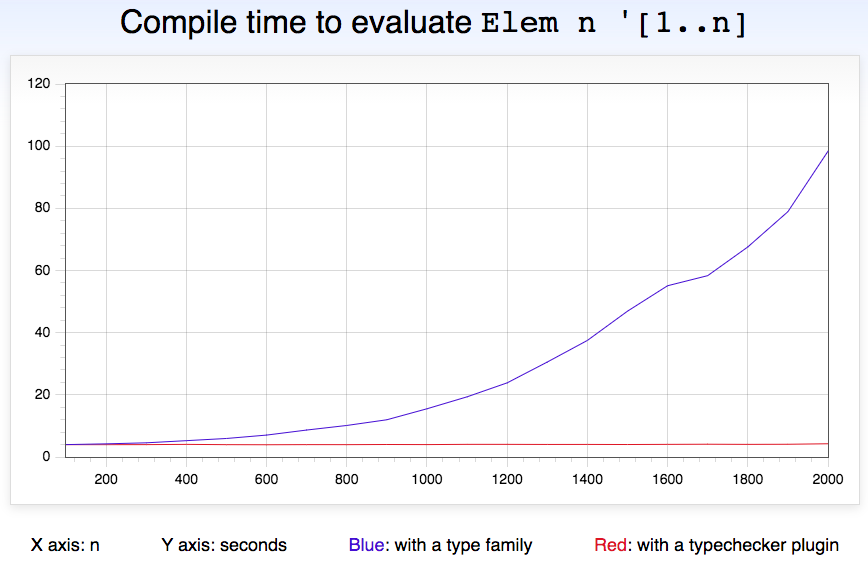

# Magic Typelevel Elem

Demonstrating how to make type families faster using typechecker plugins.



The type family implementation is the obvious one:

```haskell
type family Elem a as where
  Elem a '[]       = 'False
  Elem a (a ': as) = 'True
  Elem a (b ': as) = Elem a as
```

The algorithm looks linear, but for some reason the compilation time is clearly quadratic.

The typechecker-plugin version of the type family has no implementation:

```haskell
type family Elem a as
```

The typechecker plugin receives ghc's value-level representation of the types `n` and `'[1..n]`, computes `any (== n) (toList ns)`, and converts the resulting Bool to ghc's value-level representation of type-level booleans.

The algorithm is still linear, but this time it actually runs in linear time, and the constant factors are so good that its plot looks flat compared to the type family approach!
